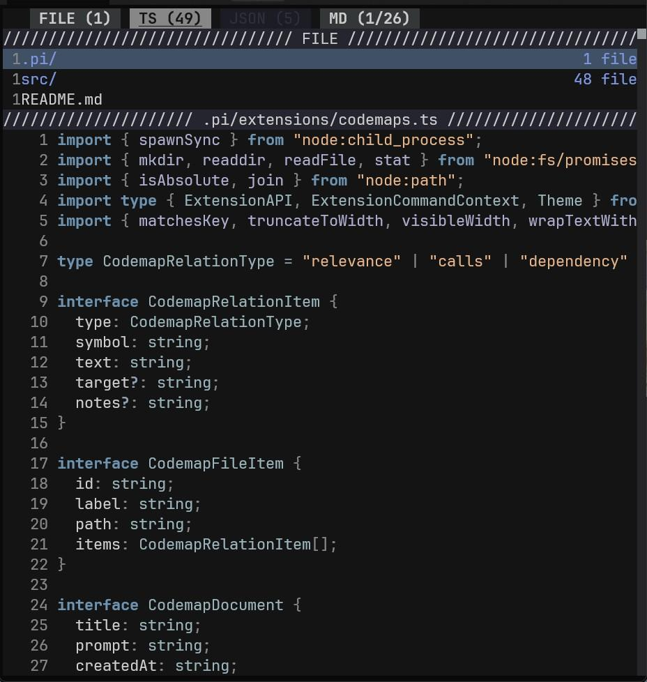
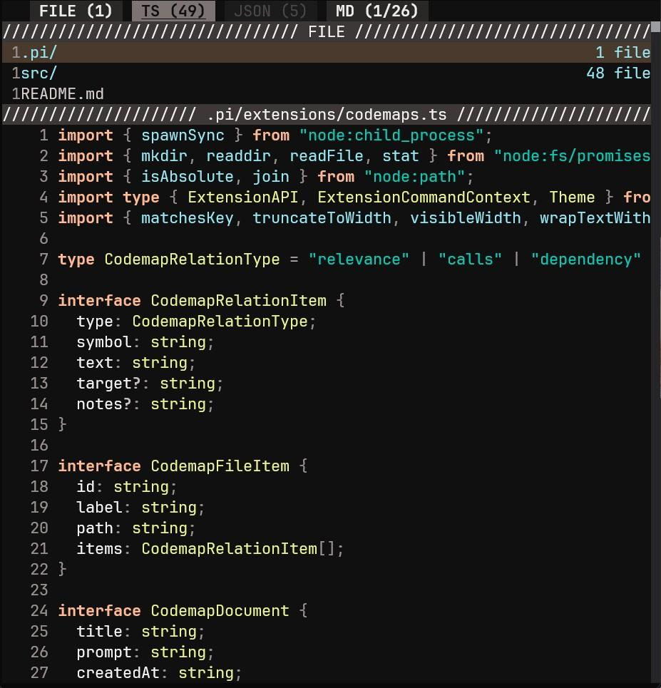
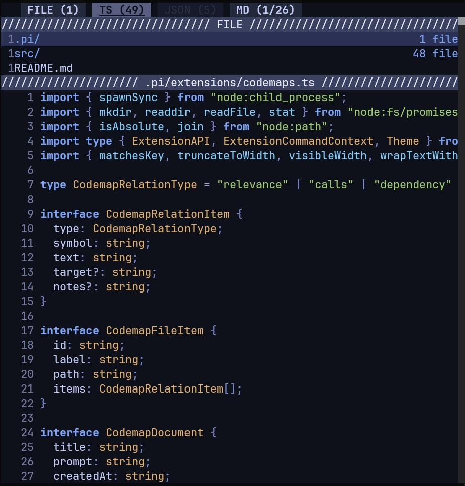
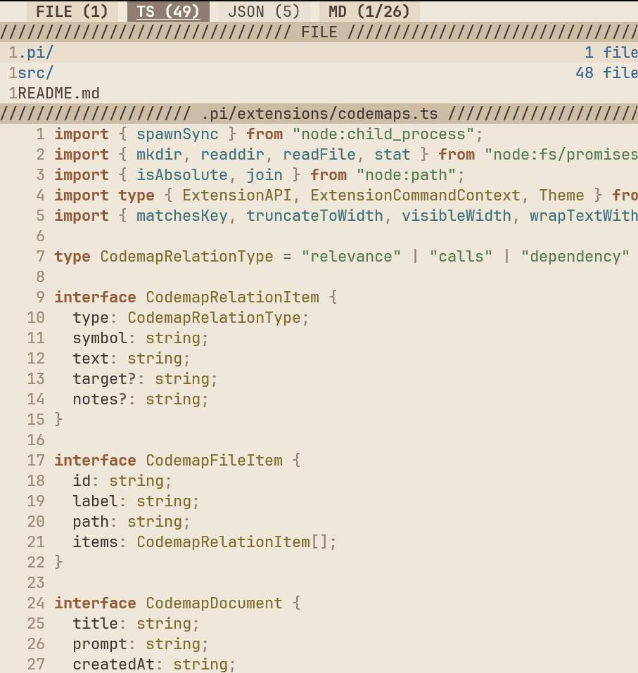

# comment-mode

<div align="center">
  
</div>

## Installation

```bash
git clone
bun install
```

## Themes

| Theme | Preview |
|-------|---------|
| vague |  |
| opencode |  |
| tokyoNight |  |
| soda |  |

## Shortcuts

### Global
| Key | Action |
|-----|--------|
| `?` | Toggle this shortcuts modal |
| `q` | Quit application |
| `t` | Cycle theme |
| `s` | Save current state as group or update selected group |
| `Tab` | Switch focus between code and chips |

### Code Navigation
| Key | Action |
|-----|--------|
| `j` / `Down` | Move cursor down |
| `k` / `Up` | Move cursor up |
| `PgDn` | Move cursor down by one page |
| `PgUp` | Move cursor up by one page |
| `gg` | Jump to top |
| `G` | Jump to bottom |
| `n` | Jump to next file |
| `p` | Jump to previous file |
| `a` | Jump to next agent update |
| `Enter` | Open file/directory or open prompt |
| `Backspace` | Go to parent directory |
| `c` | Collapse/expand current structure |
| `i` | Ignore current file from view |
| `r` | Reset chips, collapse, and ignore |
| `e` | Open current location in $EDITOR |
| `x` | Delete agent update at cursor |

### Selection
| Key | Action |
|-----|--------|
| `v` | Toggle visual selection mode |
| `Esc` | Exit visual selection mode |
| `y` | Copy selected text to clipboard |

### Type Chips Focus
| Key | Action |
|-----|--------|
| `Left` / `Right` | Move selected chip |
| `Space` | Toggle selected type chip |
| `Enter` | Toggle selected type chip or apply selected group chip |
| `x` | Delete selected group chip |

### Group Naming
| Key | Action |
|-----|--------|
| `Enter` | Confirm group name |
| `Esc` | Keep generated name |

### Prompt
| Key | Action |
|-----|--------|
| `Esc` | Close prompt |
| `Tab` | Cycle prompt field |
| `Enter` | Submit prompt or move between fields |
| `Model: Left` / `Up` | Previous model |
| `Model: Right` / `Down` | Next model |
| `Model: r` | Refresh model list |
| `Thinking: Left` / `Up` | Previous reasoning level |
| `Thinking: Right` / `Down` | Next reasoning level |
